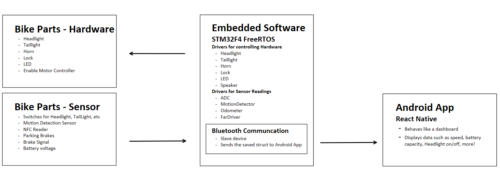
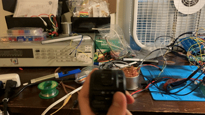
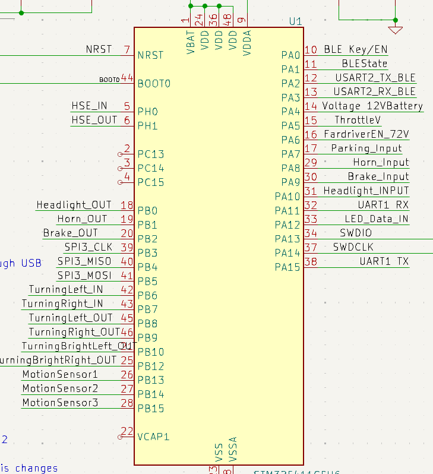
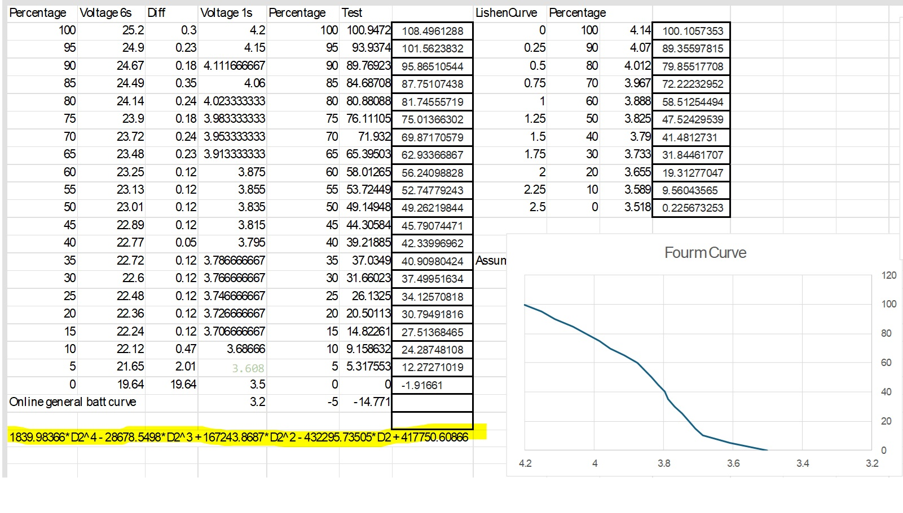
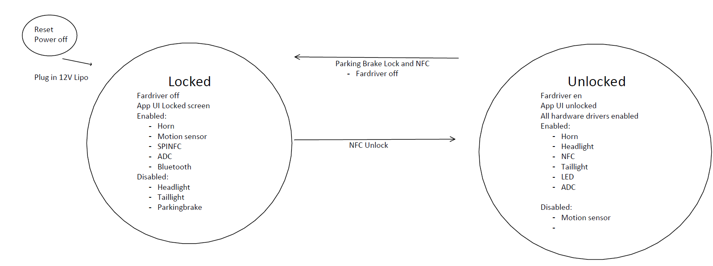
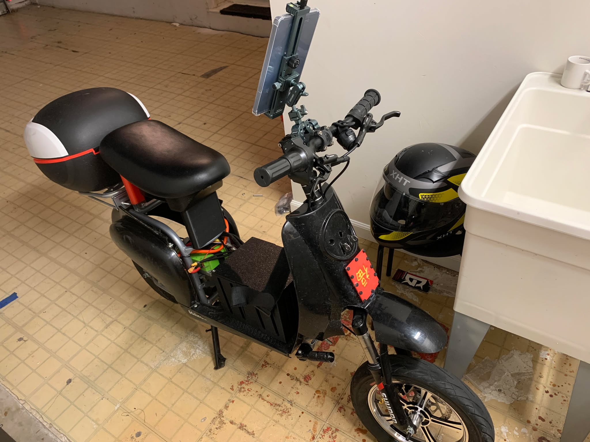

# E-Bike Infotainment System

## Software Module Summary

The three modules are comprised of **Hardware, Embedded Software, and Android App Software.**
- The Microcontroller is an STM32F4 microcontroller running **FreeRTOS**. Each peripheral has a separate task that handles the firmware drivers for its operation. This allows certain peripherals that demand **ontime scheduling** to get their share of clock cycles.
- Embedded Software contains drivers for accessing:
  - **headlights, tail lights, car horn** - GPIO debounced switch, mosfet, relays
  - **NFC scanner and keycard unlock** - SPI communication with NFC chip (PN532)
  - **PWM LED lights** - PWM driver for WS2812B to control color
  - **Human detection alarm** - Interrupt driven by IR sensor
  - **Serial communication** - UART DMA to Bluetooth module
  - **Battery monitoring** - ADC, battery curve implemented as a polynomial regression
  - **Speedometer** - Hall effect sensor on wheel
- The Microcontroller sends **Bluetooth (BLE) data** to the Android Tablet.
- The display is an Android Tablet running a **mobile app** created using **React Native**

<a href="https://github.com/tommy20gun/Bike-STM32/tree/master/CustomDrivers"><strong>Explore the Code » </strong> </a>

(<a href="#readme-top">back to top</a>)

## Demo

### Turn Signals

(<a href="#readme-top">back to top</a>)

### Microcontroller Pinout -  KiCAD EDA:

<a href="https://github.com/tommy20gun/Bike-STM32/tree/master/Docs/Diagrams/Bike_PCB.pdf"><strong>Explore the eCAD » </strong> </a>

(<a href="#readme-top">back to top</a>)

### Battery Curve

(<a href="#readme-top">back to top</a>)

### State Machine Implementation of Lock

(<a href="#readme-top">back to top</a>)

### Bike

<!-- LICENSE -->
## License

Distributed under the MIT License. See `LICENSE-MIT.txt` for more information.

(<a href="#readme-top">back to top</a>)

<!-- CONTACT -->
## Contact

Tommy Xu: xuhaohui20@gmail.com

(<a href="#readme-top">back to top</a>)
